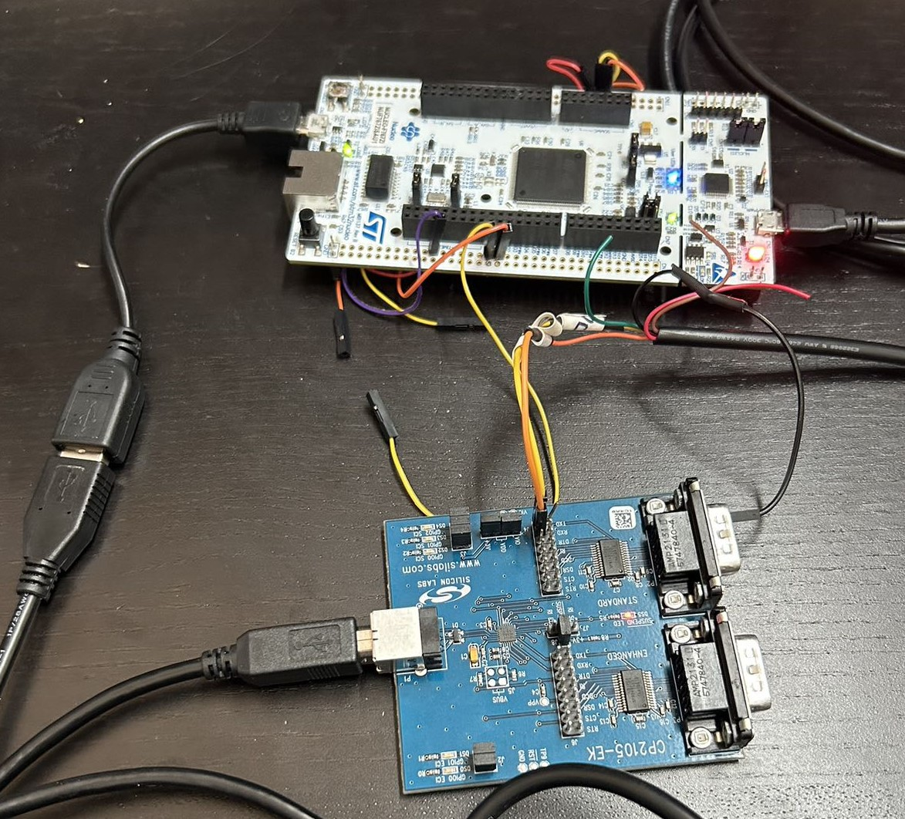

# CP2105 USB Host Driver for STM32

This repository contains the USB Host driver implementation for STM32 to communicate with the Silicon Labs CP2105, a dual USB-to-UART bridge device. This driver is specifically developed to replace the standard STM32 USB CDC class, which does not support vendor-specific devices like CP2105.

## Overview

CP2105 is a composite USB device that provides dual UART interfaces. The STM32 CDC class does not natively support this, so a custom driver was developed to handle the CP2105's unique control requests and data communication. The driver provides the ability to set baud rates, transmit, and receive data on both UART ports of the CP2105.

### Key Features
- Supports communication with CP2105's dual UART channels:
  - **Standard Port (SCI Port)**: Supports baud rates from 2400 bps to 921600 bps.
  - **Enhanced Port (ECI Port)**: Supports baud rates from 300 bps to 2.0 Mbps.
- Implements baud rate configuration for both UART channels, allowing flexible control over communication speeds.
- Supports data transmission and reception via USB bulk transfer.

## Hardware Setup

This section describes how the STM32 and CP2105 dev board are connected. The following photo shows the physical connection:

<p align="center">
  
</p>


### Connection Details

1. **STM32 as USB Host**: 
   - The STM32 is configured as a USB host and is connected to the CP2105 development board via the USB port.
   - The STM32 is powered by a PC through ST-Link, which also allows it to send debugging messages to the PC using USART3.
   
2. **CP2105 as USB-to-UART Bridge**:
   - CP2105’s UART ports (SCI and ECI) are connected to a PC using an FTDI chip, which acts as a UART-to-USB converter.
   
3. **Message Flow (Bidirectional)**:
   - The message flow between the PC and STM32 via the CP2105 is **bidirectional**.
   - A Python script running on the PC sends data to the CP2105 via one of its UART channels, and CP2105 forwards this data to the STM32 through the USB connection.
   - Similarly, the STM32 can send data back to the PC through the CP2105's UART ports, enabling bidirectional communication.
   - The STM32 prints out the received messages to the PC via ST-Link (USART3), which also serves as the debugging interface.

Here's a simplified diagram of the bidirectional connection:
```markdown
PC (Python script) --> FTDI (UART-to-USB) --> CP2105 --> USB --> STM32 (USB Host) --> PC (ST-Link USART3 for debugging)
```

### USB Enumeration Process

The USB enumeration process, handled by `usbh_core.c` in `Middlewares/ST/STM32_USB_Host_Library/Core/Src`, involves several key steps. Upon connecting the CP2105 to the STM32 (acting as USB Host), the STM32 resets the device, requests the device descriptor (containing Vendor ID, Product ID, and more), assigns a unique address, and retrieves the configuration descriptor. After setting the device configuration, the STM32 initializes the CP2105 class driver, enabling bidirectional data transfer between the host and device.

## Deployment

To integrate this driver into your STM32 project, follow the steps below:

1. **Place the Driver Files:**
   Copy [`usbh_cp2105.c`](https://github.com/johnnywang3739/USB-VCP-host-driver/tree/main/Middlewares/ST/STM32_USB_Host_Library/Class/CDC/Src) and [`usbh_cp2105.h`](https://github.com/johnnywang3739/USB-VCP-host-driver/tree/main/Middlewares/ST/STM32_USB_Host_Library/Class/CDC/Inc) into the same directory where the USB Host files are located. Specifically, place them in the following directories:
   
   - `usbh_cp2105.c` should be placed in `Middlewares/ST/STM32_USB_Host_Library/Class/CDC/Src`, the same location as [`usbh_cdc.c`](https://github.com/johnnywang3739/USB-VCP-host-driver/tree/main/Middlewares/ST/STM32_USB_Host_Library/Class/CDC/Src).
   
   - `usbh_cp2105.h` should be placed in `Middlewares/ST/STM32_USB_Host_Library/Class/CDC/Inc`, alongside [`usbh_cdc.h`](https://github.com/johnnywang3739/USB-VCP-host-driver/tree/main/Middlewares/ST/STM32_USB_Host_Library/Class/CDC/Inc).


2. **Register the CP2105 Class in `usb_host.c`:**
   In the `USB_HOST/App/usb_host.c` file, comment out the CDC class registration and replace it with the CP2105-specific registration. Follow the steps shown in the example figure below:

   **Figure 1: File Directory for the USB Host Code**

   ```c
   // Comment out the CDC registration
   // USBH_RegisterClass(&hUsbHostFS, USBH_CDC_CLASS);

   // Register CP2105 class 
   USBH_RegisterClass(&hUsbHostFS, USBH_CP2105_CLASS);
    ```

### Usage Example in Main:
In the `main.c` file, you can handle the transmission and reception through the CP2105 dual UART ports as demonstrated below:

```c
if (Appli_state == APPLICATION_READY) {
    uint32_t baud_rate = 921600;
    USBH_CP2105_SetBaudRate(&hUsbHostFS, baud_rate, CP2105_STD_PORT);
    
    uint8_t tx_buffer[] = "Hello CP2105!";
    USBH_CP2105_Transmit(&hUsbHostFS, tx_buffer, sizeof(tx_buffer), CP2105_STD_PORT);
}

```

### Testing Data Reception
Python script (`test_cp2105_receive.py`) is to send data to CP2105 and verify that STM32 properly receives the data. ST-Link will transmit debugging messages (at 9600 baud) back to the PC for validation.

### Testing Data Transmission
To check if data is transmitted from the STM32 to the CP2105 via USB port, open a terminal (e.g., PuTTY) and monitor the COM port associated with the CP2105 (UART out). Set the baud rate to match the one configured for the CP2105 in the STM32 code.

### FreeRTOS Task Setup

In the FreeRTOS branch, the USB communication and processing are divided into separate tasks to efficiently manage the USB and UART communication flow:

- **USBProcessTask**: Handles USB enumeration and communication with the CP2105. This task has the highest priority and continuously processes USB events, ensuring the STM32 communicates properly with the CP2105 device.
  
- **TransmitTask**: Manages sending data from the STM32 to the CP2105. This task verifies that the application is ready and sends data over the selected UART port of the CP2105.

- **ReceiveTask**: Handles receiving data from the CP2105 to the STM32. This task ensures proper mutex handling to prevent data conflicts and processes the incoming data.

Each task operates in a multitasking environment using FreeRTOS, allowing USB processing, data transmission, and reception to occur concurrently without blocking one another.

## References
This driver was developed with reference to the following resources:

- [Linux CP210x Driver](https://github.com/torvalds/linux/blob/master/drivers/usb/serial/cp210x.c): The Linux driver served as a guide for understanding how to communicate with the CP2105 via USB.
- [Silicon Labs CP210x Datasheet](https://www.silabs.com/documents/public/application-notes/AN571.pdf): This datasheet provided details on control transfer commands, endpoint configuration, and interface configuration specific to the CP2105.
